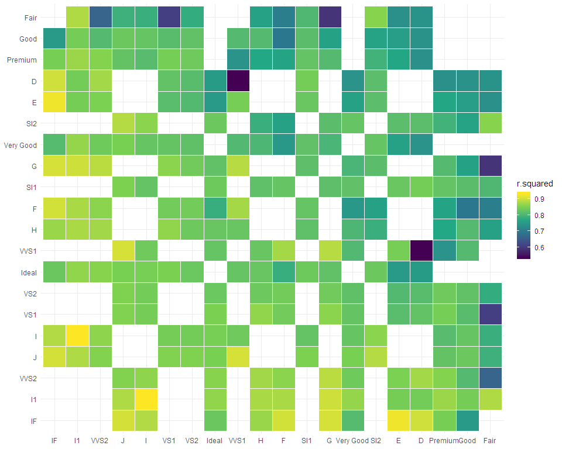

# Automated Many Models in R

`autumn` is designed to streamline the many-models approach for
exploratory data analysis and hypothesis testing.

  - `auto_mm()` is a function to apply a model to many different subsets
    of data.

  - `model_maker()` is a function factory to create a model function
    that can be applied with `purrr`.

  - `extract_model_metric()` is a function for getting model metrics
    using the `broom` package.

# Installation

``` r
devtools::install_github("zanidean/autumn")
```

# Example

``` r
library(tidyverse)
library(autumn)
```

This will create a nested dataframe that has every subset of data, along
with it’s models and corresponding model statistics.

``` r
df = diamonds %>% 
  auto_mm(model = model_maker(lm, price ~ x + y + z), # defines model to test
          split = c("cut", "color", "clarity"), # defines what to cut the data by
          permutations = 2) %>% # defined how many permutations of cuts to make
  extract_model_metric("p.value") %>% 
  extract_model_metric("r.squared")
```

This will create a plot of the many-models along a gradient
corresponding to the quality statistic you define.

``` r
df %>% plot_mm(r.squared)
```

<!-- -->
